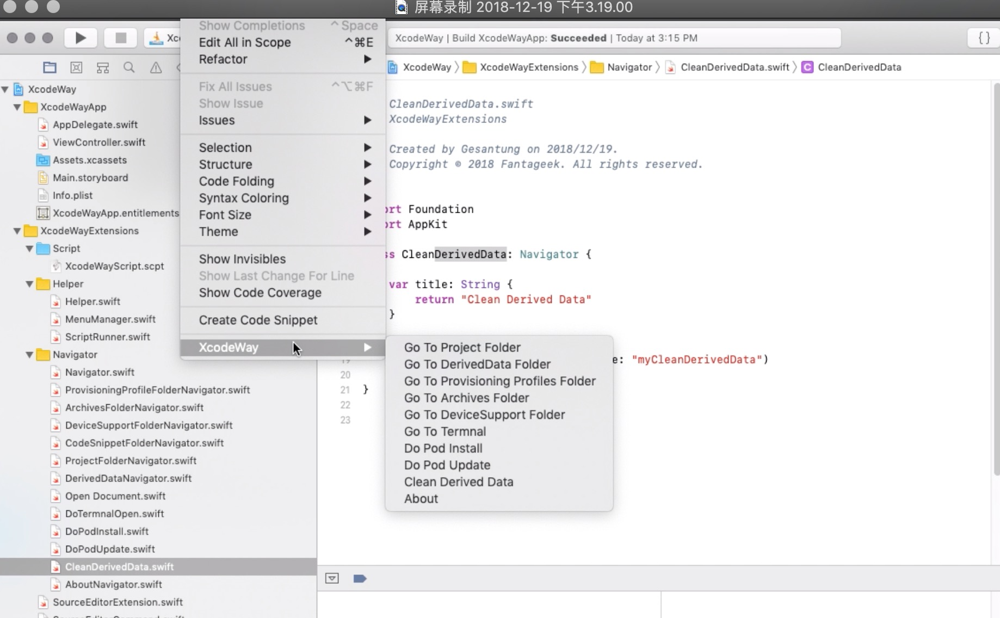
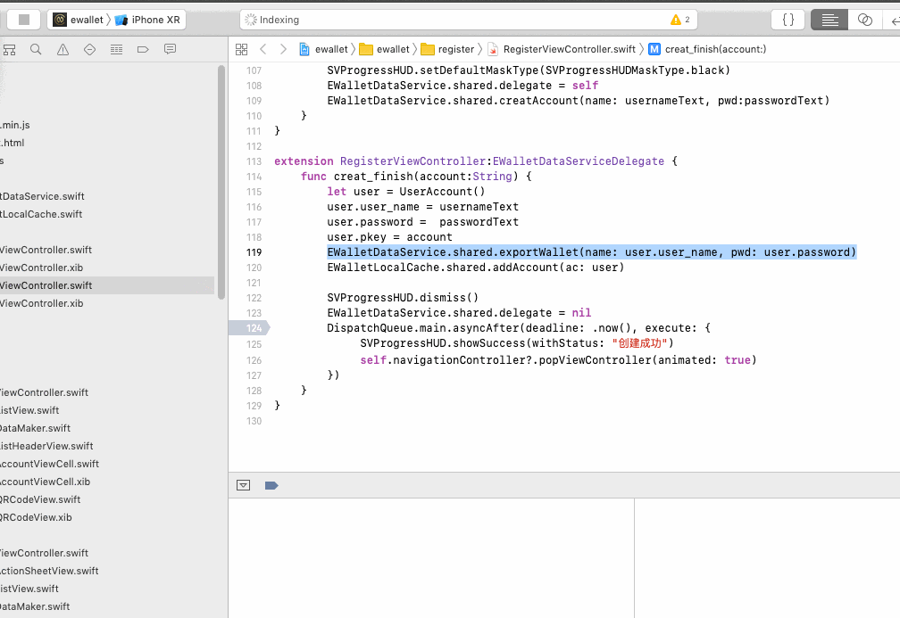
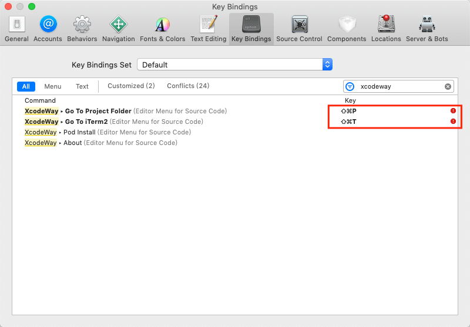

XcodeWay
==


## 简介

- XcodeWay 是一个Xcode Extension扩展，通过一系列的快捷方式提高生产效率
- 可通过Xcode  `Editor -> XcodeWay`使用




## 功能

最新功能需运行尝试，文档不是最新

- [x] 一键打开工程根目录
- [x] 一键打开终端并跳到工程根目录
- [x] 一键打开DerivedData目录
- [x] 一键打开Provisioning Profiles目录
- [x] 一键打开Archives目录
- [x] 一键打开DeviceSupport目录
- [x] 一键Pod Install
- [x] 一键Pod update
- [x] 一键清除DerivedData

## 可扩展

如果你有其他好的想法，可实现Navigator协议，添加更多好用的功能.

```swift
protocol Navigator {
func navigate()
var title: String { get }
}
```

## 如何安装 install

1. 下载 <https://github.com/ripperhe/XcodeWay/releases>
2. 打开项目编译运行
3. 系统偏好设置 > 扩展 > Xcode Source Editor 勾选 XcodeWay
4. 在终端执行命令，用于下载脚本
	
	```
	curl -fsSL https://raw.githubusercontent.com/ripperhe/XcodeWay/master/install.sh | sh
	```
5. 开始使用

⚠️ 如果安装不起作用，**则将第 2 个步骤替换为以下步骤**，然后进行安装，[本方法源于该文章](https://github.com/Bouke/SwiftInitializerGenerator#installation)

1. 打开项目
2. 在 menu bar 选择 Product > Archive
3. 右键选中 Archive 出来的项目 > Show in Finder
4. 右键 XcodeWayApp....xcarchive > 显示包内容
5. 将 Products/Applications/XcodeWayApp.app 路径下的 XcodeWayApp.app 拖到应用程序文件夹
6. 在启动台打开 XcodeWayApp，然后关闭
7. 接下来接着之前的安装方法进行安装

## 如何卸载 uninstall

1. 彻底关闭 Xcode
2. 在 Finder 中全局搜索 `XcodeWayApp.app`，并删除
3. 删除 `~/Library/Application Scripts/com.fantageek.XcodeWayApp.XcodeWayExtensions/XcodeWayScript.scpt`
	
	```sh
	$ rm ~/Library/Application\ Scripts/com.fantageek.XcodeWayApp.XcodeWayExtensions/XcodeWayScript.scpt
	```
4. 完成

## 添加快捷键

快捷键按照以下方法设置，可自行设置喜欢的快捷键。



红色感叹号是因为其他快捷键有冲突，我这里不影响使用。强迫症的话，可以换成其他快捷键，或者把冲突解决掉。

只要软件中添加过的 navigator menu 在这里都会有快捷键设置的command，即便是卸载了也会有。如果想要删除某一条已经废弃的 command，可以去以下目录里的 plist 文件中手动删除，**删除的时候要谨慎**，别删除了。

```
~/Library/Developer/Xcode/UserData/KeyBindings/Default.idekeybindings
```

## 感谢

本项目fork自

* onmyway133/XcodeWay <https://github.com/onmyway133/XcodeWay>
* GesanTung/XcodeWay <https://github.com/GesanTung/XcodeWay>

## Credit

- Icon https://www.emojione.com/

## Licence

This project is released under the MIT license. See LICENSE.md.


